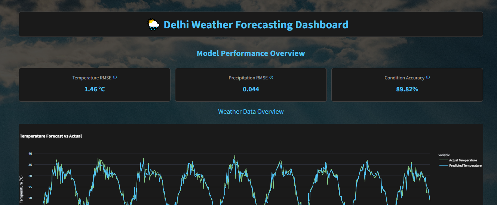
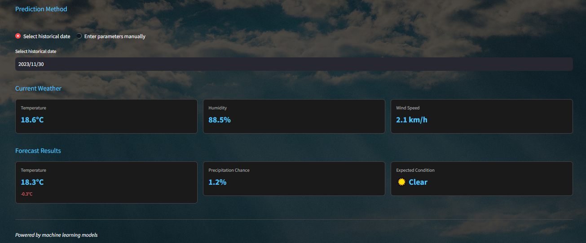
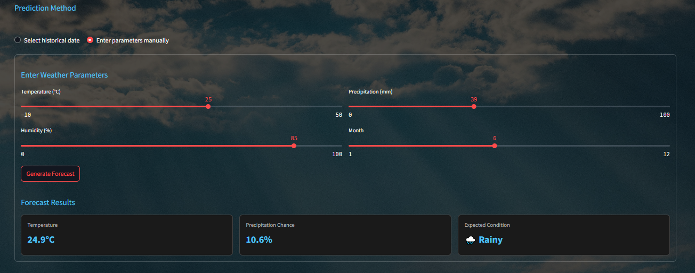

<h1 align="center">🌧️ Delhi Weather Forecasting Dashboard</h1>

<h2 align="center">📅 Project Overview</h2>
The **Delhi Weather Forecasting Dashboard** is an interactive and visually rich Streamlit application that utilizes historical weather data and machine learning models to forecast future weather conditions in Delhi. This tool is especially helpful for users who want quick and informed weather insights based on past trends or customized parameter inputs.

<h2 align="center"> 🔧 Key Features & Technologies</h2>
### Features:
- Interactive dashboard for weather insights and forecasts.
- Predict next-day temperature, precipitation probability, and weather condition.
- Two prediction modes:
  - Based on selected historical dates.
  - Manual input of weather parameters.
- Performance metrics to evaluate model accuracy (RMSE, classification accuracy).
- Visual comparison between predicted and actual temperature.
- Styled for dark mode with a modern look and weather-themed icons.

### Technologies Used:
- **Python**
- **Streamlit** - Web app framework for interactive dashboards.
- **scikit-learn** - Machine Learning models (Random Forest).
- **Meteostat** - Historical weather data.
- **Pandas & NumPy** - Data manipulation.
- **Plotly** - Interactive visualizations.
- **Imbalanced-learn** - Handling classification imbalance.

<h2 align="center">🚀 Setup Instructions</h2>
Follow these steps to set up and run the project locally:

### 1. Clone the Repository
```bash
git clone https://github.com/yourusername/delhi-weather-dashboard.git
cd delhi-weather-dashboard
```

### 2. Create a Virtual Environment (optional but recommended)
```bash
python -m venv venv
source venv/bin/activate  # On Windows: venv\Scripts\activate
```

### 3. Install Required Packages
```bash
pip install -r requirements.txt
```

If `requirements.txt` is missing, install manually:
```bash
pip install streamlit pandas numpy plotly meteostat scikit-learn imbalanced-learn
```

### 4. Run the App
```bash
streamlit run app.py
```

### 5. Explore the Dashboard  
Visit [Weather Prediction App Dashboard](https://weather--prediction-app.streamlit.app/) in your browser to interact with the app.

---


## 📸 Screenshots

### 📍 Model Dashboard Views

#### 1. Main Forecasting Dashboard


#### 2. Model Evaluation & Analysis




## 📅 Data Source

- [Meteostat API](https://dev.meteostat.net/) — Historical weather data

---

## 📌 Future Enhancements

- Add real-time weather prediction
- Integrate additional models (e.g., LSTM, XGBoost)
- Deploy using Streamlit Cloud or Hugging Face Spaces

---

## 📬 Contact

**Author:** Abhishek Choudhary  
**GitHub:** [abhishekchoudhary0210](https://github.com/abhishekchoudhary0210)

---


Made with ❤️ by Our Team
